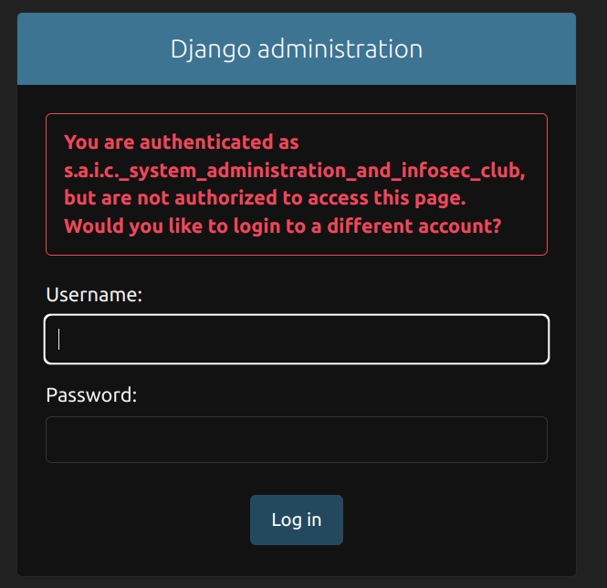

## GYMKHANA Calendar


### User guide:

1. Adding events:
    
    
    * Click on `+` to login. Only club IDs are allowed to add events. Request admins if club ID has to be enabled.
    

    * Click on `+` again to start adding event
    

    * Among below options: <br>
    **If `Allow Overlaps` is disabled(`No`) when creating events then other clubs will not be able to add events in that duration. Hence disable it only if necessary.**
    

------------------------------------------------------------
* **By default Secretaries/clubs can edit only the events added through their IDs.**

* However permission can be given to allow to edit events added by others.<br>To check it go to [admin page(/admin)](https://activities.iitmandi.co.in/admin)

1. If logged in and `Allowed to schedule events` you will see:


1. If logged in and `NOT allowed to schedule events` you will see:

OR
 

**If scheduling permissions are needed, kindly request the admins to add your `club ID` to `edit-event` group**

---------------------------------------

### Editing events:
1. Go inside `Scheduling(admin/events/event/)` page. You can view schedule times in calendar and all the events below the calendar.


1. To edit event: just click on them, edit and save.

---------------------------------------
### __Installing and running__

Clone the repository

Add  `ALLOWED_HOSTS` in `mycalendar/settings.py` for deployment

### Install virtual environment

Install **pip** first

    sudo apt-get install python3-pip

Then install **virtualenv** using pip3

    pip3 install virtualenv 

Now create a virtual environment

    virtualenv venv 

>you can use any name insted of **venv**

Active your virtual environment:

    source venv/bin/activate

Run the following commands in project directory.

You might need to delete **db.sqlite3** to start afresh.

```bash
pip install -r requirements.txt
python manage.py makemigrations
python manage.py migrate --run-syncdb
python manage.py collectstatic
python manage.py createsuperuser
python manage.py runserver
```

### Adding Google OAuth2.0 API Key's credentials in admin Social Applications.
1. create a Google Cloud Console Project.
2. Go to Credentials, Auth consent, add a new app.
3. Create new OAuth Credentials and download the json.


4. Go to [http://127.0.0.1:8000/admin](http://127.0.0.1:8000/admin) and sign in as superuser.
5. Add a new `Site`.
6. Add the `Social Applications` and the credentials and the site.
7. Copy `.env.sample` to a new file `.env` and add above credentials here also.
8. You are ready to run the App!

For running the web-app on the server as a background process, use **nohup**.
```bash
nohup python manage.py runserver &  
```
This will output a *PID*, which can be later used to kill the process.

-------------------------
## Updates:

> Note: http urls are no longer supported for non local domains

> "python manage.py createsuperuser" should be run separately when in Docker to create the admin

> In `/admin` page, setup "Social applications"

> users directly sign in using Oauth, only clubs/secretaries can create events so add them to clubs separately from `/admin` page


